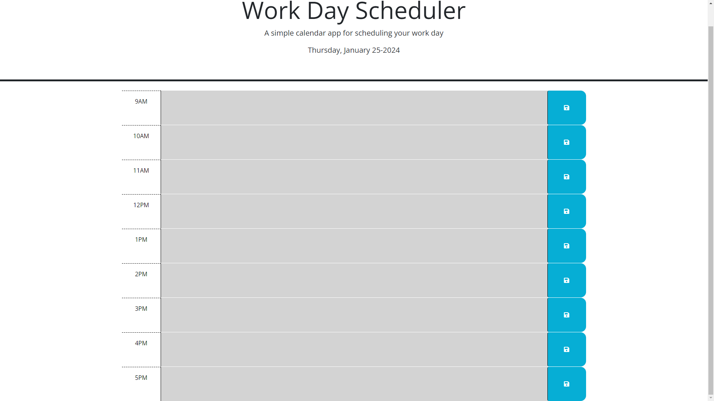

# Time-Management-Planner
An easy to use planner to organize the day. 
## Description
Time management is important for staying productive throughout the day. With this daily scheduler, users can keep track of important events, or plan the day. 

### Usage
Users can type in the allotted time box their events and click the save icon to save that event. If the user refreshes the page, they will see their saved event remaining in the time box until deleted. At the hour of the event, the time box will turn red. If the event hour has not occurred yet, the time box will be green. Lastly, if the event has past, the time box will gray. 

#### Image

##### Website
https://pwoods125.github.io/Time-Management-Planner/

